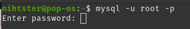
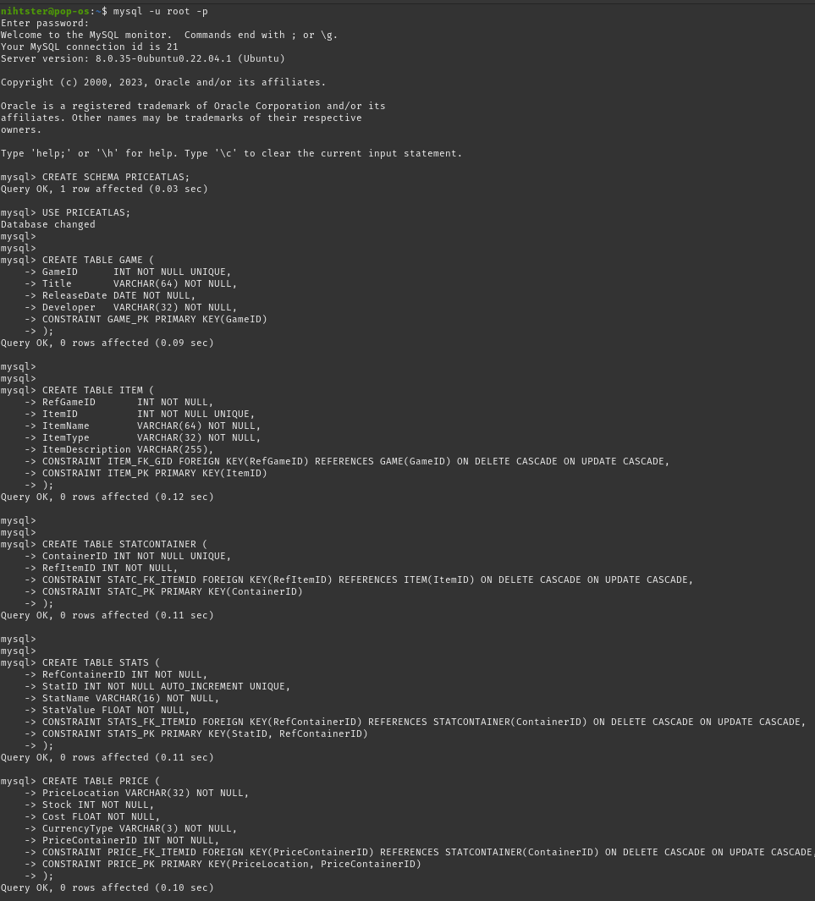
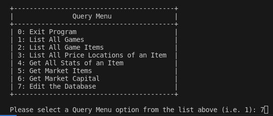
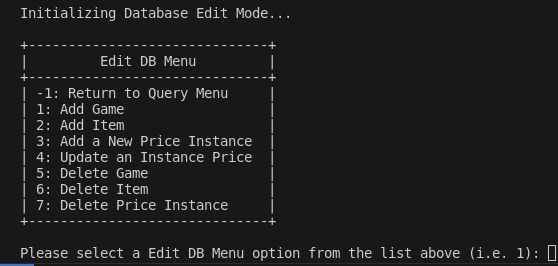

# PriceAtlas

A CLI application built for tracking the prices
of in-game items (in-game and real currency)
for various video games.

## Dependencies

This application requires the use of MySQL community server and assumes
that the user understands how to interact with the MySQL client. If not,
please follow the official instructions for setting up MySQL on your system [here](https://dev.mysql.com/doc/refman/8.2/en/installing.html).

## Setting up the MySQL Database

Launch the MySQL command line client and login

```bash
mysql -u [username] -p
```



<br>
Copy the creation scripts from [MySQL creation script files](https://github.com/Nihtster/PriceAtlas/blob/main/priceAtlas/src/MySQL_Creation_Script.txt)
into the terminal. The blank database is now available to be used for the rest of the program.



## Run Locally

#### Clone the project

```bash
  git clone https://github.com/Nihtster/PriceAtlas
```

#### Go to the project directory

```bash
  cd priceAtlas
```

#### Compile the java code

Windows:

```bash
javac -d classes src/PriceAtlas.java
```

Linux:

```bash
javac -d classes src/*.java
```

#### Start the application

Copy over the the connector jar file from the 'lib' folder into classes

```bash
cp lib/mysql-connector-j-8.2.0.jar classes
```

Enter the "classes" folder directory

```bash
cd classes
```

Run the java program

```bash
java -cp .:my-sql-connector-j-x.x.x.jar PriceAtlas
```

Replace the 'x' with the appropriate version numbers.

## Using the application

The application will prompt you for your:

- DB url (i.e. jdbc:mysql://localhost:3306/PRICEATLAS)
- username (i.e. root)
- password (i.e. MyPassword1234)
- JDBC driver package (i.e. com.mysql.cj.jdbc.Driver)

<br>
From here, you can select the prompt values for the queries you wish to perform on the database.



<br>
To insert data, enter prompt value 7 to switch to database edit mode



## Creators

|                                                                       Author                                                                       |                                                                    Collaborator                                                                     |                                                                         Collaborator                                                                         |                                                                        Collaborator                                                                        |
| :------------------------------------------------------------------------------------------------------------------------------------------------: | :-------------------------------------------------------------------------------------------------------------------------------------------------: | :----------------------------------------------------------------------------------------------------------------------------------------------------------: | :--------------------------------------------------------------------------------------------------------------------------------------------------------: |
| [<br><sub>@Nihtster</sub>](https://github.com/Nihtster) <br><br> | [<br><sub>@Nathmon565</sub>](https://github.com/Nathmon565) <br><br> | [<br><sub>@Tristan Breen</sub>](https://github.com/TristanBreen) <br><br> | [<br><sub>@Xander Treat</sub>](https://github.com/MisterX2003) <br><br> |

## Roadmap

- [x] Working Database Structure
- [x] Working Command Line Interface (CLI)
- [ ] Working Graphical User Interface (GUI)
  - [ ] Swing?
  - [ ] JavaFX?
  - [ ] Web Browser?

#### Quality of life

- [x] Refactor the java code structure
- [ ] Alter the Database Structure
- [ ] Refactor system for ease of Installation
  - [ ] Create executable jar
- [ ] implement a password hiding feature

## Contributing

If you have a suggestion that would make this better, please fork the repo and create a pull request. You can also simply open an issue with the tag "enhancement". Don't forget to give the project a star! Thanks again!

1. Fork the Project
2. Create your Feature Branch (git checkout -b feature/AmazingFeature)
3. Commit your Changes (git commit -m 'Add some AmazingFeature')
4. Push to the Branch (git push origin feature/AmazingFeature)
5. Open a Pull Request

Please adhere to this project's `code of conduct`.

## License

[MIT](https://choosealicense.com/licenses/mit/)
